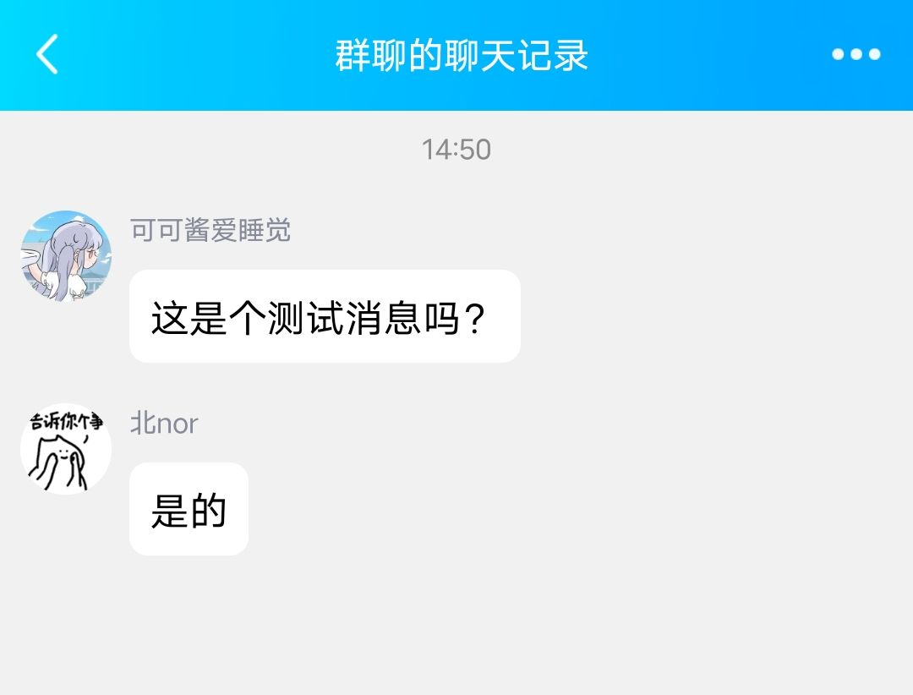
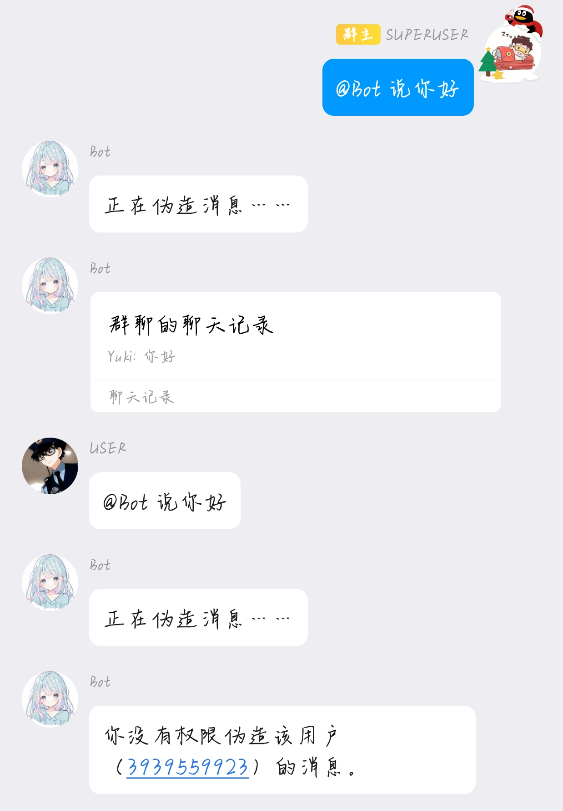

<div align="center">
    <a href="https://onebot.adapters.nonebot.dev">
      
    </a>
  </div>
</div>


<div align="center">

# nonebot-plugin-fakemsg

_⭐基于`Nonebot2`的`onebot 11`的合并转发伪造消息插件⭐_

<a href="https://www.python.org/downloads/release/python-390/" class="badge">

</a>
<a href="" class="badge">

</a>
<a href="https://github.com/Cvandia/nonebot-plugin-fakemsg/blob/main/LICENSE" class="badge">

</a>
<a href="https://v2.nonebot.dev/" class="badge">

</a>
<a href="https://onebot.adapters.nonebot.dev" class="badge">

</a>
</div>

## ⭐ 介绍

<div align="center">  

## 目前仅支持文字格式消息伪造
</div>

> 什么？你也想让你朋友出糗？！来试试伪造他的消息吧，


<div align="center">

#### 有啥关于该插件的新想法的，可以提issue或者pr (>A<)

</div>

## 💿 安装

<details>
<summary>安装</summary>

pip 安装

```
pip install nonebot-plugin-fakemsg
```
- 在nonebot的pyproject.toml中的plugins = ["xxx"]添加此插件

nb-cli安装

```
nb plugin install nonebot-plugin-fakemsg -U
```

git clone安装(不推荐)

- 运行
`git clone https://github.com/Cvandia/nonebot-plugin-fakemsg`
- 在运行处
把文件夹`nonebot-plugin-fakemsg`复制到bot根目录下的`src/plugins`(或者你创建bot时的其他名称`xxx/plugins`)

 
 </details>
 
 <details>
 <summary>注意</summary>
 
 推荐镜像站下载
  
 清华源```https://pypi.tuna.tsinghua.edu.cn/simple```
 
 阿里源```https://mirrors.aliyun.com/pypi/simple/```

</details>


## ⚙️ 配置
### 在env.中添加以下配置

|       配置        | 类型  | 默认值 |                     说明                     |
| :---------------: | :---: | :----: | :------------------------------------------: |
|    user_split     |  str  |  "|"   |            不同人伪造消息的分隔符            |
|   message_split   |  str  |  空格  |         用于分隔同一个人的消息分隔符         |
| fakemsg_whitelist |  str  |   无   | 无法用于消息伪造的账号（SUPERUSERS不受限制） |

## ⭐ 使用
<details>
<summary>使用效果图如下</summary>

> 指令如下


> 效果如下



> 效果如下



**支持识别`@xxx`的消息,如`@群友1 说你好啊|@群友2 我很好！`**

</details>

---

**注意**
> 指令触发方式是`on_message`的，不需要加指令前缀

## 🌙 目前以及未来
 - [x] 支持[go-cqhttp](https://github.com/Mrs4s/go-cqhttp)伪造消息
 - [x] 支持[Lagrange.core](https://github.com/LagrangeDev/Lagrange.Core)伪造消息
 - [x] 支持[NapcatQQ](https://github.com/NapNeko/NapCatQQ)伪造消息
 - [x] 支持`白名单`模式，仅SUPERUSERS可伪造位于白名单账号的消息，建议填入Bot本身和SUPERUSERS的账号
 - [ ] 支持`图片,卡片`等格式消息

<div align="center">

_喜欢记得点个[star](https://github.com/Cvandia/nonebot-plugin-fakemsg)哦!⭐_

</div>

## 💝 特别鸣谢

- [x] [Nonebot](https://github.com/nonebot/nonebot2): 本项目的基础，非常好用的聊天机器人框架。
- [x] [Onebot](https://onebot.dev/): 统一的聊天机器人应用接口标准。简洁、通用、可扩展，只需使用一套标准即可为各种平台编写聊天机器人
